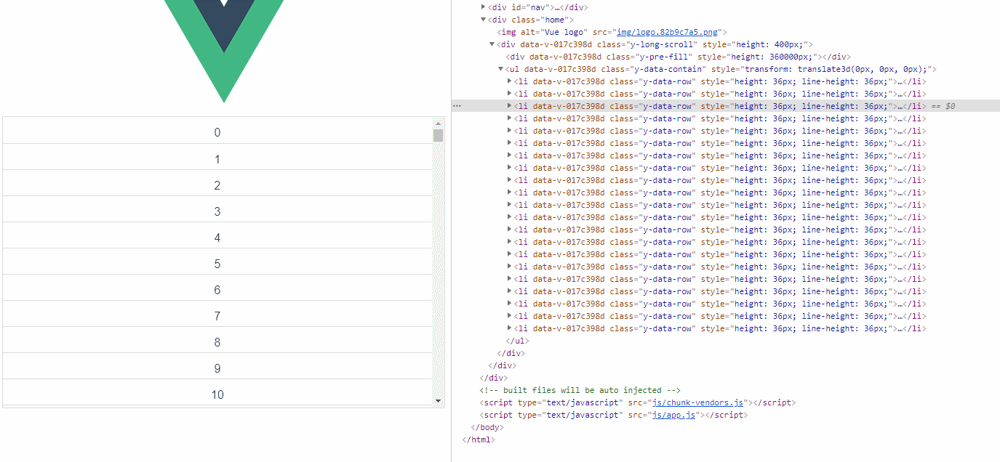

# vue-long-scroll

## Get Start 

### Installation

```
npm i --save vue-long-scroll
```

### Initialization
```
import Vue from "vue";
import LongScroll from "vue-long-scroll"
import "vue-long-scroll/lib/vue-long-scroll.css"
```

### Usage
```
<template>
    <long-scroll v-model="current" :data="data" :style="{height:'400px'}"></long-scroll>
    // or
    <long-scroll v-model="current" :data="data" :style="{height:'400px'}">
      <template #default="{row}">
        {{row.name}}
      </template>
    </long-scroll>
</template>

<script>
    data(){
        return {
            current:0,  // 当前展示的数据第一条索引
            data:[] // 数据结构[{name:""}]
        }
    }
</script>
```
## 效果


## 属性方法说明/option
| 属性/方法      | 描述 | 默认值 |
| ----------- | ----------- | ----------- |
| v-model  | 当前展示的数据第一条索引  | 0  |
| data      | 要展示的所有数据       |\ |
| current   | 当前展示的数据第一条索引        | 0  |
| size | 要渲染到Dom的数据条数 | 20 |
| valueKey   | 行展示默认内容的键  | name  |
| rowHeight  | 每行展示的高度  | 36  |
| change  | 当前数据改变事件  |   |

## License

[MIT License](https://opensource.org/licenses/MIT)

Copyright (c) 2021-present, YangJianFei <1294485765@qq.com>

## Source Code
[https://github.com/YangJianFei/vue-long-scroll](https://github.com/YangJianFei/vue-long-scroll)
## My Git
[YangJianFei](https://github.com/YangJianFei)